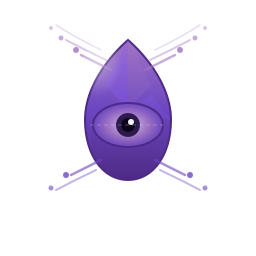

<div align="center">
  

  <h1>ObservLib</h1>

  <p>
    <strong>OpenTelemetry observability library for Elixir</strong>
  </p>

  <p>
    Unified interface for distributed tracing, metrics collection, and structured logging
  </p>

  <p>
    <a href="https://hex.pm/packages/observlib">
      
    </a>
    <a href="https://hexdocs.pm/observlib">
      
    </a>
    <a href="LICENSE">
      
    </a>
  </p>
</div>

---

## Features

- **Distributed Tracing** - Create spans with automatic context propagation
- **Metrics Collection** - Counters, gauges, histograms with OTLP export
- **Structured Logging** - Contextual logs with OpenTelemetry integration
- **OTLP Export** - Built-in exporters for traces, metrics, and logs
- **Telemetry Integration** - Automatic instrumentation via Erlang telemetry
- **Pyroscope Support** - Continuous profiling integration

## Installation

Add `observlib` to your dependencies in `mix.exs`:

```elixir
def deps do
  [
    {:observlib, "~> 0.1.0"}
  ]
end
```

## Quick Start

Configure in `config/config.exs`:

```elixir
config :observlib,
  service_name: "my_service",
  otlp_endpoint: "http://localhost:4318"
```

Use in your application:

```elixir
# Traces
ObservLib.traced("db_query", %{"db.system" => "postgresql"}, fn ->
  Repo.all(User)
end)

# Metrics
ObservLib.counter("http.requests", 1, %{method: "GET", status: 200})
ObservLib.histogram("http.duration", 45.2, %{method: "GET"})

# Logs
ObservLib.Logs.info("Request processed", user_id: 123, duration_ms: 42)
```

## Architecture

```
+------------------+
|    ObservLib     |  <-- Public API facade
+------------------+
         |
    +----+----+----+
    |         |    |
+-------+ +-------+ +------+
| Traces| |Metrics| | Logs |
+-------+ +-------+ +------+
    |         |        |
    +----+----+--------+
         |
+------------------+
|  OTLP Exporters  |  --> Jaeger, Prometheus, Loki, etc.
+------------------+
```

**Key Modules:**

| Module | Description |
|--------|-------------|
| `ObservLib` | Main API with convenience functions |
| `ObservLib.Traces` | Span creation and management |
| `ObservLib.Metrics` | Counter, gauge, histogram recording |
| `ObservLib.Logs` | Structured logging with context |
| `ObservLib.Telemetry` | Erlang telemetry event handlers |
| `ObservLib.Config` | Runtime configuration GenServer |

## Documentation

- [Getting Started Guide](guides/getting-started.md) - Installation and first steps
- [Configuration Guide](guides/configuration.md) - All configuration options
- [Custom Instrumentation Guide](guides/custom-instrumentation.md) - Advanced patterns

## Examples

See the `examples/` directory for runnable scripts:

```bash
mix run examples/basic_usage.exs
```

## Configuration Options

| Option | Default | Description |
|--------|---------|-------------|
| `service_name` | **required** | Service name for telemetry |
| `otlp_endpoint` | `nil` | OTLP collector endpoint |
| `resource_attributes` | `%{}` | Additional resource attributes |
| `pyroscope_endpoint` | `nil` | Pyroscope profiling endpoint |
| `telemetry_events` | `[]` | Event prefixes to instrument |

Full configuration example:

```elixir
config :observlib,
  service_name: "api_server",
  otlp_endpoint: "http://otel-collector:4318",
  resource_attributes: %{
    "service.version" => "1.0.0",
    "deployment.environment" => "production"
  },
  telemetry_events: [
    [:phoenix, :endpoint],
    [:ecto, :repo]
  ]
```

## API Reference

### Traces

```elixir
# Execute function within a span
ObservLib.traced(name, attributes \\ %{}, fun)

# Manual span management
span = ObservLib.Traces.start_span(name, attributes)
ObservLib.Traces.set_attribute(key, value)
ObservLib.Traces.set_status(:ok | :error, message \\ "")
ObservLib.Traces.record_exception(exception)
ObservLib.Traces.end_span(span)
```

### Metrics

```elixir
# Counter (monotonically increasing)
ObservLib.counter(name, value \\ 1, attributes \\ %{})

# Gauge (point-in-time value)
ObservLib.gauge(name, value, attributes \\ %{})

# Histogram (distribution)
ObservLib.histogram(name, value, attributes \\ %{})
```

### Logs

```elixir
# Log at specific levels
ObservLib.Logs.debug(message, attributes)
ObservLib.Logs.info(message, attributes)
ObservLib.Logs.warn(message, attributes)
ObservLib.Logs.error(message, attributes)

# Add context to multiple logs
ObservLib.Logs.with_context(%{request_id: id}, fn ->
  # All logs in this block include request_id
end)
```

### Telemetry

```elixir
# Attach handlers for telemetry events
ObservLib.Telemetry.setup()
ObservLib.Telemetry.attach([:my_app, :worker])
ObservLib.Telemetry.detach([:my_app, :worker])
```

## Contributing

1. Fork the repository
2. Create a feature branch (`git checkout -b feature/my-feature`)
3. Make your changes
4. Run tests (`mix test`)
5. Run quality checks (`mix credo` and `mix dialyzer`)
6. Submit a pull request

## License

MIT License. See [LICENSE](LICENSE) for details.
